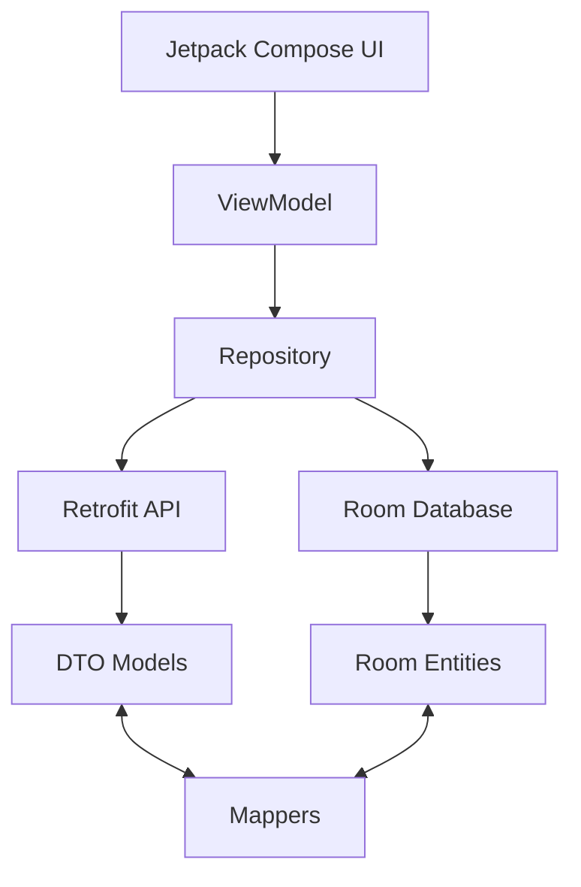

# 🕒 SyncTime - Quản lý Chấm công Thông minh

SyncTime không chỉ là một ứng dụng chấm công, nó là hệ thống quản lý nhân sự tối ưu dành cho các mô hình kinh doanh F&B và bán lẻ. Ứng dụng giải quyết triệt để vấn đề "chấm công hộ" bằng công nghệ xác thực đa lớp.

---

## 🌟 Điểm nổi bật về Công nghệ

- **Multi-layered Verification**: Kết hợp giữa **Wifi BSSID Fingerprinting** và **Hardware ID Tracking**.
- **Modern UI/UX**: Xây dựng hoàn toàn bằng **Jetpack Compose** với cơ chế Recomposition tối ưu.
- **Offline First**: Sử dụng **Room Database** để lưu trữ dữ liệu local, đảm bảo nhân viên vẫn xem được lịch làm khi mất mạng.
- **Clean Architecture**: Tách biệt rõ ràng các lớp DTO, Entity và Mapper để dễ dàng bảo trì và mở rộng.

---

## 📸 Demo & Màn hình (Dự kiến)

| Màn hình Nhân viên | Màn hình Quản lý | Màn hình Admin |
| :--- | :--- | :--- |
| Dashboard & Check-in | Duyệt đơn từ ca làm | Quản lý Chi nhánh |
| Lịch làm việc cá nhân | Sắp xếp lịch (Multi-add) | Báo cáo lương tổng |
| Lịch sử chấm công | Thống kê vắng mặt | Cấu hình lương chức vụ |

---

## 🛠 Hướng dẫn thiết lập chi tiết

### 1. Cấp quyền truy cập (Quan trọng)
Ứng dụng cần các quyền sau để hoạt động chính xác:
- `ACCESS_FINE_LOCATION`: Bắt buộc để đọc thông tin Wifi BSSID trên Android 10+.
- `INTERNET`: Để đồng bộ dữ liệu với Backend.

### 2. Cấu hình Server (Backend)
- Nếu bạn sử dụng Emulator: Đổi Base URL thành `http://10.0.2.2:8080/`
- Nếu dùng thiết bị thật: Đổi thành địa chỉ IP máy tính của bạn (Ví dụ: `http://192.168.1.5:8080/`)
- File cấu hình: `app/src/main/java/com/example/synctime/data/api/ApiClient.kt`

### 3. Xử lý khi gặp lỗi "Wifi không xác định"
- Đảm bảo **GPS/Vị trí** đã được bật trên điện thoại.
- Cấp quyền "Always allow" cho quyền vị trí của ứng dụng.

---

## 🏗 Kiến trúc dự án (Detail)

## 🤝 Đóng góp
Chúng tôi hoan nghênh mọi sự đóng góp. Vui lòng đọc [CONTRIBUTING.md](CONTRIBUTING.md) để hiểu quy trình gửi Pull Request.

---
© 2024 SyncTime Team. Developed with ❤️ for better management.
